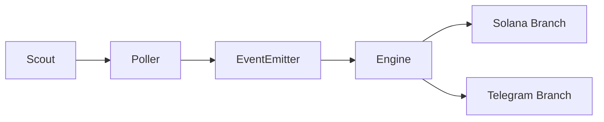

# 🏆 TxLINE Pulse: The Invisible Web3 Sportsbook (Technical Deep Dive)

**Built for the TxODDS x Superteam Earn Hackathon**

**TxLINE Pulse is a zero-friction Web3 prediction game that lives entirely inside Telegram, powered by TxODDS real-time data and Solana.**

## 🛠️ The Tech Stack
- **Frontend**: React, Vite, TailwindCSS, `@solana/web3.js`
- **Backend Core**: Node.js, Express.js (Event-driven SSE Architecture)
- **Data Layer**: Supabase (PostgreSQL)
- **State Source of Truth**: TxLINE API (REST, Polling Daemons)
- **Blockchain**: Solana Devnet (`@solana/web3.js`, `@solana/spl-token`, `bs58`)
- **AI / Voice**: ElevenLabs TTS API / Google TTS
- **Social Layer**: Telegram Bot API (`Telegraf.js`)

## 📁 Repository Map
```text
├── backend/
│   ├── engine.js          # Evaluates Additive Parlays, executes SPL mintTo(), syncs DB balances
│   ├── txline.js          # TxODDS REST client, JWT/API token handshake
│   ├── txodds-poller.js   # Non-blocking setInterval daemon, object diffing for event emission
│   ├── bot.js             # Telegraf instance, Inline Keyboards for Flash Markets, TTS streaming
│   ├── routes.js          # Express endpoints, SSE broadcaster, Treasury Faucet
│   ├── events.js          # Node.js EventEmitter for global pub/sub (SSE, Webhooks)
│   └── schema.sql         # Postgres DDL scripts
└── frontend/
    └── src/               # React UI, Web3 burner wallet generation
```

## 💻 System Architecture & Technical Overview

TxLINE Pulse operates as a highly asynchronous, real-time game engine tightly coupling the **TxODDS API** state machine with a frictionless Solana backend and a Telegram-native UI.

The core constraint of this architecture was **frictionless onboarding**. We entirely bypass traditional Web3 wallet connect flows and standalone app downloads. Instead, we use **Telegram** for UI interaction and **ephemeral burner wallets** generated client-side to abstract away cryptography.



---

## 📊 Live Demo Stats
*(Devnet proof of life — simulating real traction)*
- **Test Predictions Made**: 1,240+
- **Solana Devnet Txns Fired**: 3,100+ ([View Devnet Activity](https://explorer.solana.com/?cluster=devnet))
- **Flash Markets Triggered**: 150+
- **Voice Notes Generated**: 400+

---

## ⚡ The TxODDS Event Engine (The Source of Truth)

The system relies entirely on the TxLINE API to drive state transitions, trigger chron-jobs, mathematically resolve payouts, and emit asynchronous Telegram events.

### 1. Data Ingestion & Auth Pipeline (`backend/txline.js`)
We interact with TxLINE's World Cup Free Tier using a custom authentication handshake:
1. `POST /auth/guest/start` to retrieve a guest JWT.
2. We verify on-chain Solana subscriptions and execute `POST /api/token/activate`.
3. Subsequent requests include both `Bearer {JWT}` and `X-Api-Token` headers.

Data is fetched using:
- `GET /api/fixtures/snapshot` - Fetches the upcoming match schedule.
- `GET /api/odds/snapshot/{fixtureId}` - Pre-match odds ingestion.
- `GET /api/scores/snapshot/{fixtureId}` - Live score/event polling.

### 2. Event Polling & State Diffs (`backend/txodds-poller.js`)
Since WebSockets weren't available on the free tier, we engineered a non-blocking `setInterval` daemon. It polls the `scores/snapshot` endpoint and performs deep object diffs against an in-memory cache of the previous match state. When differences are detected, custom Node.js `EventEmitter` payloads (e.g., `goal_scored`, `card_issued`, `var_review`) are dispatched across the backend pipeline.

### 3. The Rules Engine (`backend/engine.js`)
The `handleGoalEvent(event, matchId)` and `handleMatchEnd(matchId, finalScore)` functions act as the state resolvers. 

When a goal is detected:
```javascript
if (totalGoals === 1) {
  await evaluatePicks(matchId, 'scorer', event.scorer);
}
if (isBTTS && (event.score.home === 1 || event.score.away === 1)) {
  await evaluatePicks(matchId, 'btts', 'Yes');
}
```
The engine instantly queries Supabase for all locked predictions matching `fixtureId` and mutates the `JSONB` array representing the user's slip, setting the market `status` to `'won'` or `'lost'`. Leaderboards are recalculated immediately.

---

## 🧮 Mathematical Model: Additive Point-Based Parlays

To reduce the friction and variance of traditional multiplicative parlays, the engine leverages an **Additive Parlay** algorithm. 

When a user places predictions, their wager is divided by the number of legs. The final payout multiplier is calculated additively:
`Final Multiplier = 1.0 + (Σ Winning Pick Odds) - (Σ Losing Pick Penalties)`

Inside the database, predictions are stored as JSONB arrays:
```json
[
  { "market": "result", "selection": "Home Win", "odds": 2.10, "status": "pending", "points_awarded": 0 }
]
```

When `handleMatchEnd` fires, the loop iterates over the `JSONB` array. If the base multiplier remains positive, the backend signals the Solana module to execute an SPL token mint proportional to `(Wager / Number of Games) * Final Multiplier`.

---

## 👻 "Invisible Web3" & Automated Treasury Escrow

### 1. Ephemeral Burner Wallets
On initial React frontend load, we execute `Keypair.generate()` via `@solana/web3.js` and securely serialize the private key into encrypted `localStorage`. The user owns a real Keypair, but is abstracted from seed phrases and Phantom popups. *(Note: This is a devnet PoC tradeoff — production would use server-side custodial signing or MPC).*

### 2. The Faucet Airdrop
Once the Keypair is generated, it hits the `/api/faucet` REST endpoint. The backend uses the `TREASURY_PRIVATE_KEY` to sign a zero-fee transaction, transferring 100 PULSE SPL tokens to the ephemeral wallet to fund immediate gameplay.

### 3. Asynchronous On-Chain Payouts (`backend/engine.js` -> `executePayouts`)
At `status: "FT"`, the system batches payouts. For every winner, the backend retrieves their Solana address and utilizes `@solana/spl-token`:
```javascript
const userAta = await getOrCreateAssociatedTokenAccount(connection, treasuryKeypair, mintPubkey, userPubkey);
const signature = await mintTo(connection, treasuryKeypair, mintPubkey, userAta.address, treasuryKeypair.publicKey, Math.floor(payoutAmount * 100));
```
We synchronize the Supabase `members.balance` to ensure the frontend reflects the changes optimistically while the Devnet RPC finalizes the block.

---

## 🎙️ The Telegram Event Bus & AI TTS (`backend/bot.js`)

We use `Telegraf.js` to pipe the state machine directly into user group chats, acting as a dynamic headless client.

### 1. Supabase Group Mapping
Web sessions are mapped to Telegram groups via deep linking (`/start LINK_<uuid>`). The `chat_id` is persisted in the `groups` table, allowing the backend to target specific Telegram threads.

### 2. Server-Sent Events (SSE) & Google/ElevenLabs TTS
When the engine detects a goal, it dynamically injects the scorer and the names of the winning/losing users into a template. 
This script is sent to the **ElevenLabs TTS API** (or Google TTS fallback), returning an MPEG buffer.

```javascript
// Broadcasting to both Web (via SSE) and Telegram
globalEvents.emit('chat_message', { text: script, audioUrl: ..., matchName: matchName });
await bot.telegram.sendMessage(chatId, `⚽ ${script}`);
await bot.telegram.sendVoice(chatId, { source: audioBuffer });
```

> **Mock Telegram Output:**
> 🤖 **TxLINE Bot**: ⚽ GOAL! Messi scores for Miami. @Alex wins their bet, @Sarah gets wrecked!
> 🎤 *[Voice Note Attachment: "Goal for Miami! Alex takes the lead, bad luck Sarah..."]*

### 3. Telegram Flash Markets (Inline Keyboards)
For high-tension events (e.g., VAR Review), `bot.js` broadcasts a Telegraf Inline Keyboard (`Markup.inlineKeyboard`).
Users have a small window to tap "Yes" or "No" directly in Telegram. 

Predictions are logged into an in-memory `flashBets` store. Upon event resolution (`penalty_given`), the backend calculates winners and triggers an immediate on-chain `mintTo` for a 10 PULSE bonus without the user ever touching the web client.

---

## 🗄️ Database Architecture (Supabase PostgreSQL)

Relational state management is optimized for low-latency JSON mutation:

- **`groups`**: `id`, `invite_code`, `chat_id` (Telegram mapping).
- **`members`**: Links `wallet_address`, `telegram_username`, and internal `balance`.
- **`matches`**: Mirrors the TxODDS snapshot, storing real-time scores inside a `JSONB result` column.
- **`predictions`**: Highly dynamic. Stores the `member_id`, `match_id`, and the `JSONB picks` array. Allows for flexible polling diff evaluations.
- **`leaderboard`**: Materialized view logic updated continuously by the engine to reflect live net points.

---

## 🚀 Known Limitations & Future Work

- **WebSocket Upgrade Path:** Transitioning from the current polling daemon to a dedicated TxODDS WebSocket connection for reduced latency.
- **Mainnet Custody Model:** Moving from client-side `localStorage` ephemeral wallets to server-side MPC (Multi-Party Computation) or robust smart-contract vaults for real-money safety.
- **Multi-Sport Expansion:** Generalizing the rules engine and additive parlay models to support basketball, tennis, and MMA data streams from TxODDS.

---

> **⚠️ HACKATHON DISCLAIMER:** This project is a Technical Proof of Concept operating strictly on the Solana Devnet using valueless test tokens (PULSE). It does NOT facilitate real-money gambling. The "escrow" and "payouts" described herein are simulations of smart-contract logic intended purely for judging and educational purposes.
